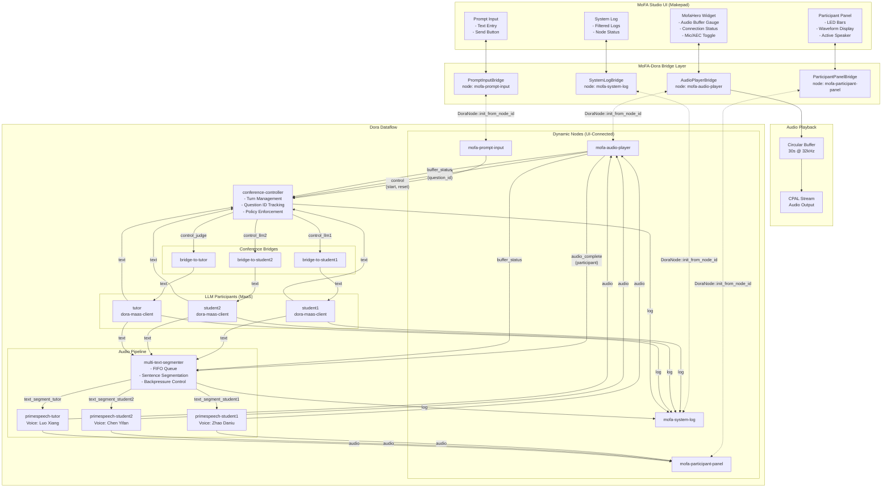
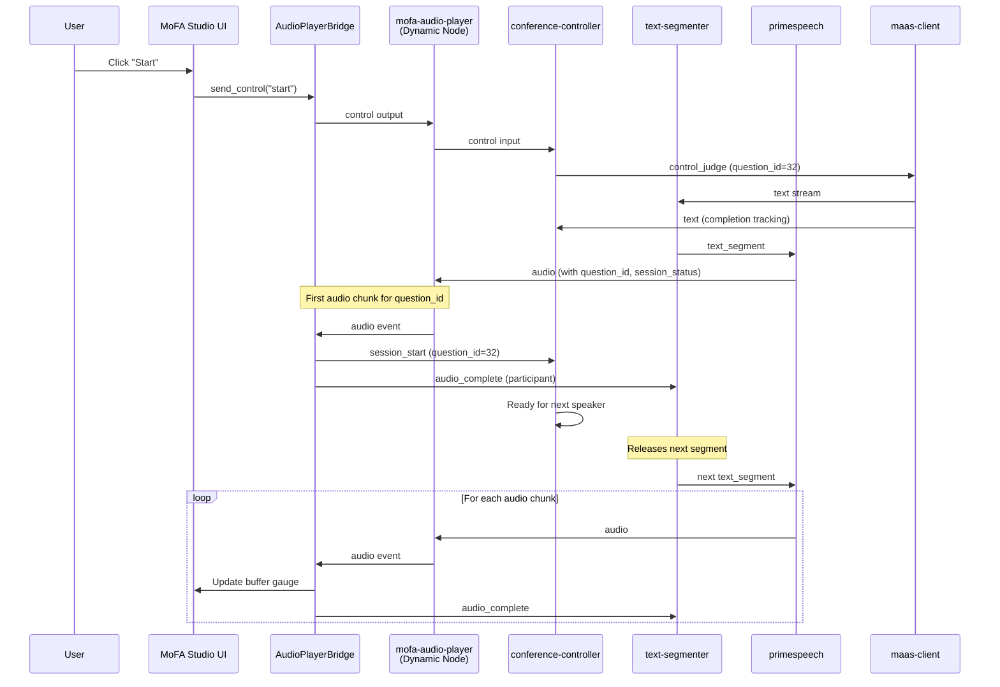
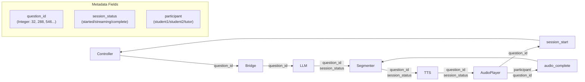

# MoFA Studio - Dora Integration Architecture

This document describes the architecture of MoFA Studio's integration with the Dora dataflow framework for real-time multi-participant voice conversations.

## System Overview



## Component Layers

### 1. UI Layer (Makepad Widgets)

| Widget | Purpose |
|--------|---------|
| `MofaHero` | Main hero display with audio buffer gauge, connection status, mic/AEC toggle |
| `ParticipantPanel` | LED visualization bars showing audio levels and active speaker |
| `PromptInput` | Text input for user prompts and control buttons |
| `SystemLog` | Aggregated log display with level filtering |

### 2. Bridge Layer (mofa-dora-bridge)

Bridges connect Makepad UI widgets to Dora dynamic nodes. Each bridge:
- Runs a background thread with Dora event loop
- Uses `DoraNode::init_from_node_id()` to attach to the dataflow
- Translates between Dora Arrow data and Rust types
- Handles metadata extraction (String, Integer, Float, Bool, Lists)

| Bridge | Node ID | Inputs | Outputs |
|--------|---------|--------|---------|
| `AudioPlayerBridge` | mofa-audio-player | audio_student1, audio_student2, audio_tutor | session_start, audio_complete, buffer_status |
| `ParticipantPanelBridge` | mofa-participant-panel | audio_student1, audio_student2, audio_tutor | - |
| `PromptInputBridge` | mofa-prompt-input | llm*_text, llm*_status | control |
| `SystemLogBridge` | mofa-system-log | *_log, *_status | - |

### 3. Dora Dataflow Layer

The dataflow consists of:
- **LLM Participants**: 3 `dora-maas-client` instances (student1, student2, tutor)
- **Conference Bridges**: Route text between participants based on controller signals
- **Controller**: Manages turn-taking with configurable policy
- **Text Segmenter**: FIFO queue with sentence segmentation and backpressure
- **TTS Nodes**: PrimeSpeech instances with different voices

## Signal Flow Sequence



## Critical Metadata Flow



### Metadata Parameter Types

The metadata extraction must handle all Dora parameter types:

```rust
let string_value = match value {
    Parameter::String(s) => s.clone(),
    Parameter::Integer(i) => i.to_string(),  // question_id is Integer!
    Parameter::Float(f) => f.to_string(),
    Parameter::Bool(b) => b.to_string(),
    Parameter::ListInt(l) => format!("{:?}", l),
    Parameter::ListFloat(l) => format!("{:?}", l),
    Parameter::ListString(l) => format!("{:?}", l),
};
```

## Critical Signals

### 1. `session_start`
- **From**: mofa-audio-player
- **To**: conference-controller
- **Purpose**: Signals that audio playback has begun for a question_id
- **Trigger**: First audio chunk received for a new question_id
- **Required Metadata**: `question_id`, `participant`

### 2. `audio_complete`
- **From**: mofa-audio-player
- **To**: multi-text-segmenter
- **Purpose**: Flow control - releases next segment from FIFO queue
- **Trigger**: Every audio chunk received
- **Required Metadata**: `participant`, `question_id`, `session_status`

### 3. `buffer_status`
- **From**: mofa-audio-player
- **To**: conference-controller, multi-text-segmenter
- **Purpose**: Backpressure control based on audio buffer fill level
- **Values**: 0-100 (percentage)

## Audio Pipeline Details

### Circular Buffer
- **Duration**: 30 seconds
- **Sample Rate**: 32,000 Hz
- **Format**: Mono f32 samples
- **Behavior**: Overwrites oldest samples when full

### Channel Buffers
- **Audio Channel**: 500 items (non-blocking with `try_send()`)
- **Event Channel**: 100 items
- **Buffer Status Channel**: 10 items

## Troubleshooting

| Issue | Cause | Solution |
|-------|-------|----------|
| Conversation stops after N rounds | `session_start` not sent for new question_id | Check metadata extraction handles Integer parameters |
| All LED panels active | Active speaker not tracked per question_id | Use HashSet to track active switches per question_id |
| Audio buffer gauge empty | `set_buffer_level()` not called | Poll audio_player.buffer_fill_percentage() in screen update |
| Pipeline stalls | Channel blocking on full buffer | Use `try_send()` instead of `send()` |
| Missing question_id | Only extracting String parameters | Extract Integer parameters too |

## File Structure

```
mofa-studio/
├── apps/mofa-fm/
│   ├── src/
│   │   ├── screen.rs          # Main screen with dora event polling
│   │   ├── audio_player.rs    # Circular buffer audio playback
│   │   ├── dora_integration.rs # DoraIntegration coordinator
│   │   └── mofa_hero.rs       # Hero widget with buffer gauge
│   └── dataflow/
│       └── voice-chat.yml     # Dora dataflow definition
├── mofa-dora-bridge/
│   └── src/
│       ├── bridge.rs          # DoraBridge trait
│       ├── data.rs            # DoraData, EventMetadata types
│       └── widgets/
│           ├── audio_player.rs      # AudioPlayerBridge
│           ├── participant_panel.rs # ParticipantPanelBridge
│           ├── prompt_input.rs      # PromptInputBridge
│           └── system_log.rs        # SystemLogBridge
└── mofa-widgets/              # Shared UI components
```

## References

- Conference Dashboard: `examples/conference-dashboard/` - Reference implementation
- Python Nodes: `python-nodes/` - Python Dora node implementations
- Rust Nodes: `rust-nodes/` - Rust Dora node implementations
- Dataflow: `apps/mofa-fm/dataflow/voice-chat.yml` - Full dataflow definition
